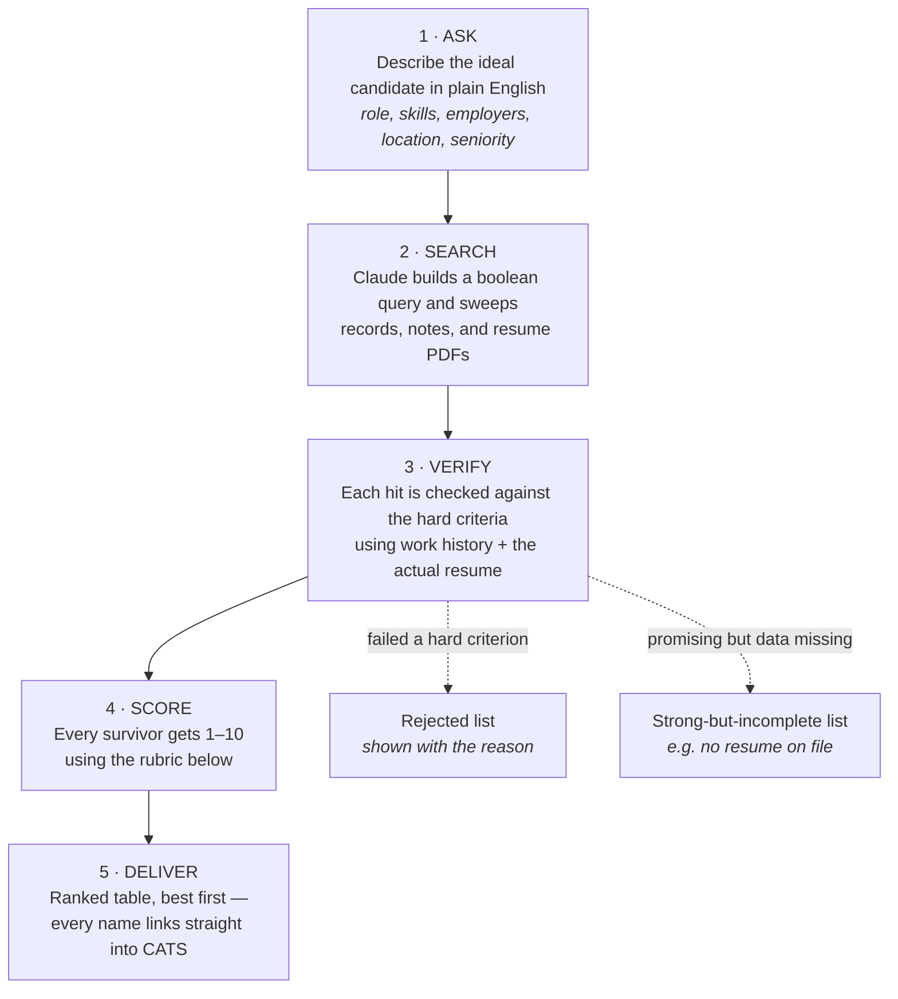

# Candidate Ranking Schematic

*How Claude turns "find me someone" into a scored, clickable shortlist — and the exact prompt to get it every time.*

---

## The flow

## The scoring rubric (1–10)

Every candidate starts at **5**, then moves on three axes:

| Axis | Adjustment | For |
|---|---|---|
| **Query match** *(dominant)* | **+3** | Every hard criterion confirmed with evidence |
| | **+2** | Criteria likely met but partly inferred |
| | **−2** | One hard criterion failed |
| | **−4** | Multiple hard criteria failed |
| **Soft criteria** | **±1** | Employer prestige, seniority fit, recency of experience |
| **Candidate quality** | **±1** | Profile completeness (resume on file, contact info) |
| | **±1** | Recruiter sentiment in our call notes |

Capped at 10, floored at 1.

## Reading the scores

| Score | Meaning | Action |
|---|---|---|
| **9–10** | Strong match | Reach out today |
| **7–8** | Solid | Worth a conversation |
| **5–6** | Borderline | Investigate the gaps first |
| **3–4** | Weak | Surface only if the list is thin |
| **1–2** | Probably wrong fit | Skip |

## The master prompt (copy, fill the brackets, send)

> Search our CATS database for candidates matching: **[describe the role — skills, employers, location, seniority, anything that matters]**.
>
> Verify each match against their work history and actual resume, then score every survivor 1–10 using our standard rubric (start at 5; query match ±, soft criteria ±1, profile completeness and note sentiment ±1 each).
>
> Give me a table sorted by score with: **Score · Name (linked to their CATS profile) · CATS ID · Current role · Location · one-line evidence for the score**. Below the table, list anyone promising-but-incomplete and anyone rejected at verification, with reasons.

### Example, filled in

> Search our CATS database for candidates matching: **quant developers with Python who worked at Two Sigma, Citadel, or DE Shaw, NYC-based, 3+ years experience**. Verify each match against their work history and actual resume, then score every survivor 1–10 using our standard rubric. Give me a table sorted by score with Score, Name linked to their CATS profile, CATS ID, current role, location, and one-line evidence. Below the table, list promising-but-incomplete and rejected candidates with reasons.

---

*Names in results link directly into CATS (e.g. `bentonpartners.catsone.com/candidates/12345`) — click any name to open the full record. In Claude Code, the `/cats-ats:search` command runs this whole flow automatically.*
